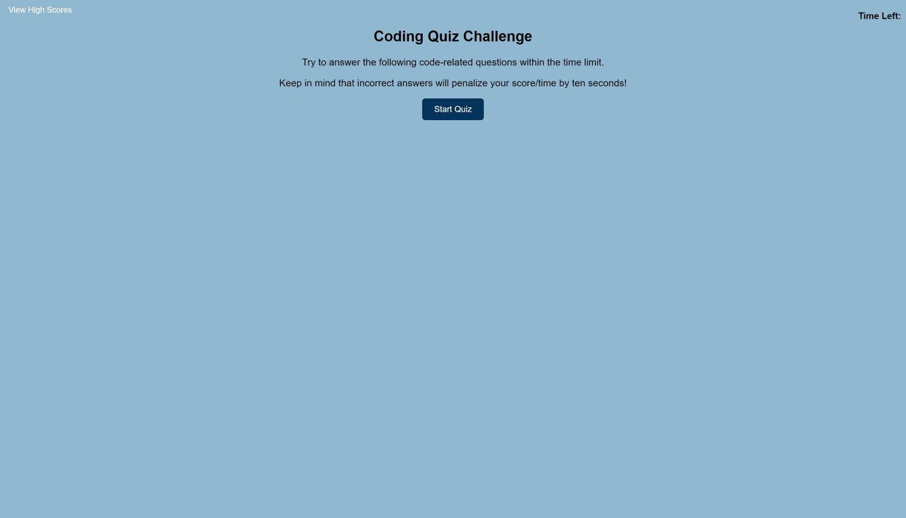

# quiz-challenge

## Description
Application which presents users with 5 multiple choice questions about javascript. After clicking "start quiz" the questions display one at a time (each with 4 answer choices), and the timer starts at 60 seconds. For each correct answer, the next question is displayed and time continues as normal. For each incorrect answer, 10 seconds is deducted from the user's time left. After the last question the user is presented with the number of questions answered correctly, their time remaining, an input box for their initials, and "play again?" and "erase high scores?" buttons. High scores are saved locally on the user's computer.

https://thrazer675.github.io/quiz-challenge/

